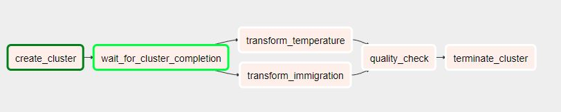

# Udacity Data Engineering Nanodegree Capstone

## Introduction
The US immigrations department is dealing with large amounts of immigration data on a daily basis, and want to move their data warehouse to a data lake. Their data comes from various government agencies and currently resides on S3. The officers have decided that it is time to introduce more automation and monitoring to their data warehouse ETL pipelines and come to the conclusion that the best tool to achieve this is Apache Airflow.

## Goal
The management wants to create a high grade data pipelines that is dynamic and built from reusable tasks, can be monitored, and allow easy backfills. They have also noted that the data quality plays a big part when analyses are executed on top the data warehouse and want to run tests against their datasets after the ETL steps have been executed to catch any discrepancies in the datasets. The project aims to build an ETL pipeline that extracts their data from S3, processes them using Spark, and loads the data back into S3 as a set of dimensional tables. This will allow their analytics team to continue finding insights in the immigration and temperature data.

## Project Datasets
- I94 Immigration Data: This data comes from the US National Tourism and Trade Office. It contains the immigration records that are partitioned by month and year. The data comes from [here](https://travel.trade.gov/research/reports/i94/historical/2016.html).
- World Temperature Data: The data contains temperature data of world cities. More information about the data can be found [here](https://www.kaggle.com/berkeleyearth/climate-change-earth-surface-temperature-data).

## Data Models
_immigration_ table will contain the normalized I94 Data:
- id
- year: 4 digit year
- month: numeric month
- city_code: 3 digit code representing a city
- port_code: 3 letter code
- state_code: 2 letter code representing a state in USA
- arrival_mode: digit representing mode of arrival
- age: numeric age
- gender: single letter representing gender
- admission_no: admission number
- visatype: Class of admission legally admitting the non-immigrant to temporarily stay in USA
- arrival_date: date of arrival to USA
- departure_date: date of departure from USA

_temperature_ table will contain the normalized World Temperature Data:
- datetime
- avg_temp: average temperature
- avg_temp_uncertainty: average temperature uncertainity
- city_code: 3 digit code representing a city
- city: name of city
- country: name of country
- latitude:
- longtitude:
- month: numeric month
- year: 4 digit year

## AWS Infrastructure
Cloudformation is utilized to setup the required infrastructure according to a [tutorial](https://aws.amazon.com/blogs/big-data/build-a-concurrent-data-orchestration-pipeline-using-amazon-emr-and-apache-livy/).


Infrastructure Breakdown:
- S3 Bucket: Stores raw and transformed dataset files
- EC2: Running Apache Airflow. DAGS are triggered from web interface
- RDS: Stores database for running Apache Airflow
- EMR: Spark cluster for data transformation

And the various security groups and roles to run the infrastructure

## ETL


- create_cluster: Creates the EMR Cluster with Master/Slave
- wait_for_cluster_completion: Polls for cluster ready state
- transform_temperature: Performs Load, Clean, Transform and Write on the World Temperature Dataset stored on S3 Bucket
- transform_immigration: Performs Load, Clean, Transform and Write on the I94 Immigratioon Dataset stored on S3 Bucket
- quality_check: Quality check on transformed Temperature and Immigration data
- terminate_cluster: Terminates the EMR cluster

## How ro run
1. Open SSH client and connect to EC2 instance with private key file
2. Enter the following commands:
```
sudo su
cd ~/airflow
source ~/.bash_profile
airflow scheduler --daemon
```
3. Navigate to Airflow Web Interface
4. Create "aws_credentials" with AWS Access/Secret key under Admin > Connections
5. Turn On DAG

## Scenarios

### Clearly state the rationale for the choice of tools and technologies for the project
AWS offers a wide set of tools for data processing. Cloudformation all enables easy infrastructure setup. S3 allows a wide range of users to be able to access data stored in the cloud. Spark provides highly reliable and fast in memory computation, and EMR clusters can be created and terminated on the fly.

### Propose how often the data should be updated and why
The DAG is configured to trigger on a monthly interval to process Immigration and Temperature data.


### Write a description of how you would approach the problem differently under the following scenarios:
- The data was increased by 100x.
    - Add more EMR clusters to handle the larger volume of data
    - Use a MPP Database such as Amazon Redshift for data warehousing
- The data populates a dashboard that must be updated on a daily basis by 7am every day.
    - DAG is configurable to run on daily intervals as fixed timings
    - Enable run retries and notification via email
- The database needed to be accessed by 100+ people.
    - Redshift is cloud-based and hosted directly on AWS. It can be scaled up/down easily by adding/removing nodes. Security configurations can also be added to restrict access
